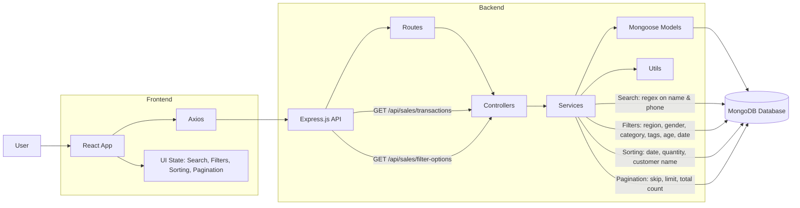

# Retail Sales Management System

# Retail Sales Management System

## 1. Overview

A full-stack MERN application built to manage, explore, and analyze large-scale retail sales data (300MB+ and 1,000,000+ records).
It provides fast and efficient **search**, **filtering**, **sorting**, and **pagination** using optimized MongoDB queries and clean architectural patterns.
The system is modular, scalable, and designed for high performance in real-world data-heavy environments.

---

## 2. Architecture Diagram



---

## 3. Tech Stack

### **Frontend**

* React 18
* Vite
* Axios
* CSS3

### **Backend**

* Node.js (ES Modules)
* Express.js
* MongoDB
* Mongoose
* CORS

---

## 4. Search Implementation Summary

* **Fields Searched:** Customer Name, Phone Number
* **Method:** Case-insensitive regex search
* **Backend:** `$or` query across indexed fields
* **Frontend:** 300ms debounced input
* **Goal:** Accurate search without overloading the DB

---

## 5. Filter Implementation Summary

* **Filters:** Region, Gender, Category, Tags, Payment Method
* **Ranges:** Age (min–max), Date (start–end)
* **Logic:** `$in`, `$gte`, `$lte` operators
* **Combination:** Full AND logic across all filters
* **State Preservation:** Filters remain active across operations

---

## 6. Sorting Implementation Summary

* **Options:**

  * Date: Newest → Oldest / Oldest → Newest
  * Quantity: High → Low / Low → High
  * Customer Name: A–Z / Z–A
* **Method:** `.sort()` on indexed fields
* **Default:** Date (Newest First)

---

## 7. Pagination Implementation Summary

* **Page Size:** 10 records per page
* **Method:** MongoDB `skip()` + `limit()`
* **Extras:**

  * Ellipsis page navigation
  * Previous / Next buttons
* **State Reset:** Resets to page 1 when search/filter changes
* **Performance:** Only fetches current page data

---

## 8. Setup Instructions

### **Backend Setup**

```bash
cd backend
npm install
```

Create `.env`:

```
MONGODB_URI=mongodb://localhost:27017/retail_sales
PORT=5000
```

Start MongoDB (example for macOS):

```bash
brew services start mongodb-community
```

Import dataset:

```bash
mongoimport --db retail_sales --collection salestransactions --file dataset.json --jsonArray
```

Run backend:

```bash
npm start
```

Development mode:

```bash
npm run dev
```

---

### **Frontend Setup**

```bash
cd frontend
npm install
```

Optional `.env`:

```
VITE_API_BASE_URL=http://localhost:5000/api
```

Run frontend:

```bash
npm run dev
```

## Project Structure

```
root/
├── backend/
│   ├── src/
│   │   ├── controllers/
│   │   ├── services/
│   │   ├── models/
│   │   ├── routes/
│   │   ├── utils/
│   │   └── index.js
│   ├── package.json
│   └── README.md
├── frontend/
│   ├── src/
│   │   ├── components/
│   │   ├── pages/
│   │   ├── services/
│   │   ├── utils/
│   │   ├── hooks/
│   │   ├── styles/
│   │   ├── App.jsx
│   │   └── main.jsx
│   ├── public/
│   ├── package.json
│   └── README.md
└── docs/
    └── architecture.md
```

## API Endpoints

### GET /api/sales/transactions
Get sales transactions with search, filters, sorting, and pagination.

**Query Parameters:**
- `search` (string): Search term
- `sortBy` (string): Sort criteria
- `page` (number): Page number
- `pageSize` (number): Items per page
- `regions` (array): Filter by regions
- `genders` (array): Filter by genders
- `categories` (array): Filter by categories
- `tags` (array): Filter by tags
- `paymentMethods` (array): Filter by payment methods
- `ageMin` (number): Minimum age
- `ageMax` (number): Maximum age
- `dateStart` (string): Start date (ISO format)
- `dateEnd` (string): End date (ISO format)

### GET /api/sales/filter-options
Get available filter options for dropdowns.

## Features

- ✅ Full-text search (Customer Name, Phone Number)
- ✅ Multi-select filters (Region, Gender, Category, Tags, Payment Method)
- ✅ Range filters (Age, Date)
- ✅ Sorting (Date, Quantity, Customer Name)
- ✅ Pagination (10 items per page)
- ✅ Summary statistics (Total units, Total amount, Total discount)
- ✅ Responsive design
- ✅ Loading and error states
- ✅ State preservation across operations

## Architecture Document
See `/docs/architecture.md` for detailed architecture documentation.


