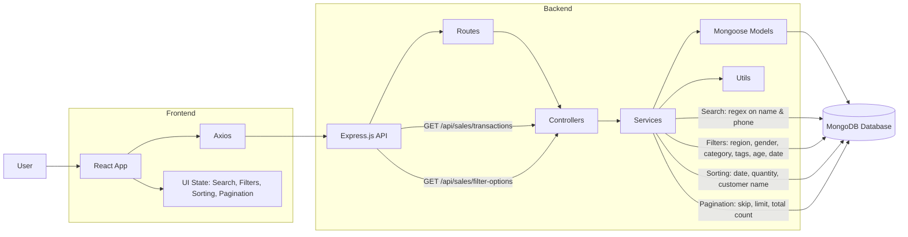

# Architecture Documentation

## Overview
The Retail Sales Management System is a full-stack MERN application designed to handle large-scale sales data (300MB+) with efficient search, filtering, sorting, and pagination capabilities.

## System Architecture

### High-Level Architecture
```
┌─────────────────┐
│   React Frontend │
│   (Port 3000)   │
└────────┬────────┘
         │ HTTP/REST API
         │
┌────────▼────────┐
│  Express Backend │
│   (Port 5000)   │
└────────┬────────┘
         │
┌────────▼────────┐
│    MongoDB      │
│   (Database)    │
└─────────────────┘
```

## Architecture Diagram



---

## Backend Architecture

### Technology Stack
- **Runtime**: Node.js with ES6 modules
- **Framework**: Express.js
- **Database**: MongoDB with Mongoose ODM
- **Port**: 5000

### Folder Structure
```
backend/
├── src/
│   ├── controllers/     # Request handlers
│   ├── services/        # Business logic
│   ├── models/          # Database schemas
│   ├── routes/          # API route definitions
│   ├── utils/           # Utility functions (DB connection)
│   └── index.js         # Entry point
├── package.json
└── README.md
```

### Key Components

#### 1. Models (`models/SalesTransaction.js`)
- Defines MongoDB schema for sales transactions
- Includes indexes for performance:
  - Text indexes on `customerName` and `phoneNumber` for search
  - Single field indexes on frequently filtered fields
  - Compound indexes for common query patterns

#### 2. Services (`services/salesService.js`)
- **`getSalesTransactions()`**: Main service function that:
  - Builds filter queries dynamically
  - Handles search with case-insensitive regex
  - Applies sorting
  - Implements pagination
  - Calculates summary statistics using aggregation
- **`getFilterOptions()`**: Fetches distinct values for filter dropdowns

#### 3. Controllers (`controllers/salesController.js`)
- Handles HTTP requests/responses
- Parses query parameters
- Validates input
- Calls service layer
- Returns JSON responses

#### 4. Routes (`routes/salesRoutes.js`)
- `/api/sales/transactions` - GET transactions with filters
- `/api/sales/filter-options` - GET available filter options

### Data Flow (Backend)
```
Request → Route → Controller → Service → Model → MongoDB
                                    ↓
Response ← Controller ← Service ← Model ← MongoDB
```

### Performance Optimizations
1. **Database Indexes**: Strategic indexes on frequently queried fields
2. **Pagination**: Limits data transfer (10 items per page)
3. **Aggregation Pipeline**: Efficient summary calculations
4. **Query Optimization**: Combined queries to reduce database round trips

## Frontend Architecture

### Technology Stack
- **Framework**: React 18
- **Build Tool**: Vite
- **HTTP Client**: Axios
- **Styling**: CSS3 (modular CSS files)
- **Port**: 3000

### Folder Structure
```
frontend/
├── src/
│   ├── components/      # Reusable UI components
│   ├── pages/           # Page components
│   ├── services/        # API service layer
│   ├── hooks/           # Custom React hooks
│   ├── utils/           # Utility functions
│   ├── styles/          # CSS modules
│   ├── App.jsx          # Root component
│   └── main.jsx         # Entry point
├── public/
├── package.json
└── README.md
```

### Key Components

#### 1. Pages
- **`SalesManagement`**: Main page component that orchestrates all features

#### 2. Components
- **`SearchBar`**: Search input with debouncing
- **`FilterPanel`**: Multi-select dropdowns and sorting
- **`SummaryCards`**: Summary statistics display
- **`TransactionTable`**: Data table with all columns
- **`Pagination`**: Page navigation controls

#### 3. Hooks
- **`useSalesData`**: Custom hook managing:
  - API calls
  - State management (transactions, pagination, summary)
  - Loading and error states
  - Filter options

#### 4. Services
- **`api.js`**: Axios-based API client
  - `getSalesTransactions()`: Fetches transactions with query params
  - `getFilterOptions()`: Fetches filter dropdown options

### Data Flow (Frontend)
```
User Action → Component → Hook → API Service → Backend API
                                              ↓
State Update ← Hook ← API Service ← Backend API
```

### State Management
- **Local State**: Component-level state using `useState`
- **Custom Hooks**: Centralized data fetching logic
- **State Preservation**: Search, filters, and sort states preserved across pagination

## Feature Implementation

### 1. Search Implementation
- **Backend**: Case-insensitive regex search on `customerName` and `phoneNumber`
- **Frontend**: Debounced input (300ms) to reduce API calls
- **Indexes**: Text indexes for performance

### 2. Filter Implementation
- **Backend**: Dynamic query building with MongoDB `$in` operators
- **Frontend**: Multi-select dropdowns with checkbox selection
- **Combination**: All filters work independently and in combination
- **State**: Filters preserved during pagination and sorting

### 3. Sorting Implementation
- **Backend**: MongoDB sort on indexed fields
- **Frontend**: Dropdown selector
- **Options**: Date (asc/desc), Quantity (asc/desc), Customer Name (A-Z/Z-A)
- **State**: Sort preserved during filtering and pagination

### 4. Pagination Implementation
- **Backend**: MongoDB `skip()` and `limit()` with count
- **Frontend**: Page numbers with ellipsis for large page counts
- **Page Size**: Fixed at 10 items per page
- **State**: Current page preserved, resets to page 1 on filter/search change

## Edge Case Handling

1. **No Search Results**: Empty state message displayed
2. **Conflicting Filters**: All filters are AND conditions (intersection)
3. **Invalid Numeric Ranges**: Frontend validation, backend handles gracefully
4. **Large Filter Combinations**: MongoDB handles efficiently with indexes
5. **Missing Optional Fields**: Displayed as "-" in table
6. **Loading States**: Loading indicators during API calls
7. **Error Handling**: Error messages displayed to user

## Database Design

### Collection: `salestransactions`
- Document-based schema matching all required fields
- Indexes on:
  - `transactionId`
  - `date`
  - `customerName` (text index)
  - `phoneNumber` (text index)
  - `gender`
  - `age`
  - `customerRegion`
  - `productCategory`
  - `tags`
  - `quantity`
  - `paymentMethod`

### Data Import
- For 300MB dataset, use MongoDB Compass or `mongoimport`
- Ensure indexes are created after import for performance

## Security Considerations
- CORS enabled for frontend-backend communication
- Input validation on backend
- No sensitive data exposure
- Environment variables for configuration

## Scalability Considerations
1. **Database**: Indexes ensure query performance with large datasets
2. **Pagination**: Limits data transfer
3. **Debouncing**: Reduces unnecessary API calls
4. **Modular Code**: Easy to extend and maintain

## Future Enhancements
- Caching layer (Redis) for frequently accessed data
- Real-time updates with WebSockets
- Export functionality (CSV/Excel)
- Advanced analytics dashboard
- User authentication and authorization

